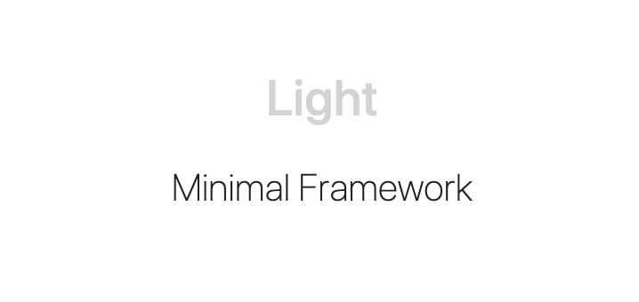

## Usage

This is a minimal framework meant to be simple to use and implement. With very little, you can have a styled website. Please see the documentation for more details.

## Installation

**npm**

```sh
$ npm install --save light-css-framework
```
then

```js
import 'light-css-framework/styles/light.css'
```

**add to project**

```html
<link rel="stylesheet" href="https://unpkg.com/light-css-framework"/>
```

## [Documentation](https://nauleau.io/light/)

Visit https://nauleau.io/light/ for detailed documentation.

## Credit

Based off of the Wing framework by [Kabir Shah](https://kabir.sh)

## License

Licensed under the [MIT License](/license)